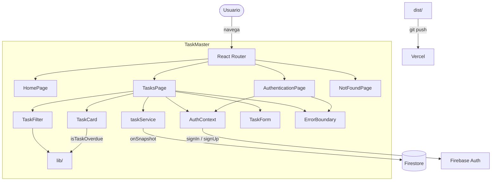

# TaskMaster

Gestor de tareas simple y moderno con React + TypeScript + Firebase.

## Stack

| Capa | Tecnología |
|---|---|
| Framework | React 18 + TypeScript |
| Build | Vite 6 + SWC |
| Estilos | Tailwind CSS 4 |
| Autenticación | Firebase Auth |
| Base de datos | Firestore (tiempo real) |
| Testing | Vitest + Testing Library |
| Formato | Prettier |
| Linter | ESLint |
| Fuente | Inter via `@fontsource/inter` |

## Arquitectura



Los diagramas de secuencia detallados están en [`docs/`](./docs/) como PNGs y código Mermaid.

## Features

- **Autenticación** — registro, login, logout, sesión persistente
- **CRUD de tareas** — crear, editar, eliminar, toggle completado
- **Tiempo real** — Firestore `onSnapshot`, cambios instantáneos
- **Vencidas** — badge rojo "Atrasada" cuando la fecha límite pasó
- **Filtros** — todas, pendientes, completadas, atrasadas
- **Prioridades** — alta, media, baja
- **Responsive** — mobile-first con Tailwind
- **Errores** — ErrorBoundary con "Reintentar" y "Recargar página", banners descartables
- **Rate limiting** — feedback visual con cuenta regresiva en `auth/too-many-requests`
- **Firestore Security Rules** — protección server-side de datos

## Estructura

```
src/
├── components/
│   ├── auth/          # ProtectedRoute, PublicRoute
│   ├── layout/        # Header, Footer, Spinner
│   └── tasks/         # TaskCard, TaskFilter, TaskForm, TaskList
├── context/
│   └── AuthContext.tsx
├── firebase/
│   ├── app.ts
│   └── credentials.ts
├── hooks/
│   └── useScrollToTop.ts
├── lib/
│   ├── errorHelpers.ts
│   ├── formatDate.ts
│   ├── isTaskOverdue.ts
│   └── index.ts
├── pages/
│   ├── AuthenticationPage.tsx
│   ├── HomePage.tsx
│   ├── NotFoundPage.tsx
│   └── TasksPage.tsx
├── services/
│   └── taskService.ts
├── test/
├── types/
│   └── index.ts
└── main.tsx
```

## Empezar

```bash
git clone https://github.com/AlejoBI/task-manager.git
cd task-manager
npm install
cp .env.example .env   # completar credenciales de Firebase
npm run dev
```

## Scripts

| Comando | Descripción |
|---|---|
| `npm run dev` | Dev server con HMR |
| `npm run build` | TypeScript check + Vite build |
| `npm run test:run` | Tests |
| `npm run format` | Formatear con Prettier |
| `npm run lint` | ESLint |

## Variables de entorno

Ver `.env.example`. Se necesita un proyecto Firebase con Authentication (email/contraseña) y Cloud Firestore.

## Firestore Security Rules

Las reglas están en `firestore.rules` y validan:
- Solo usuarios autenticados pueden leer/escribir
- Solo documentos propios (`userId == request.auth.uid`)
- `userId` y `createdAt` no se pueden modificar al actualizar

## Deploy

- **Vercel** — configurado via `vercel.json`, push a `main` depliega automáticamente

