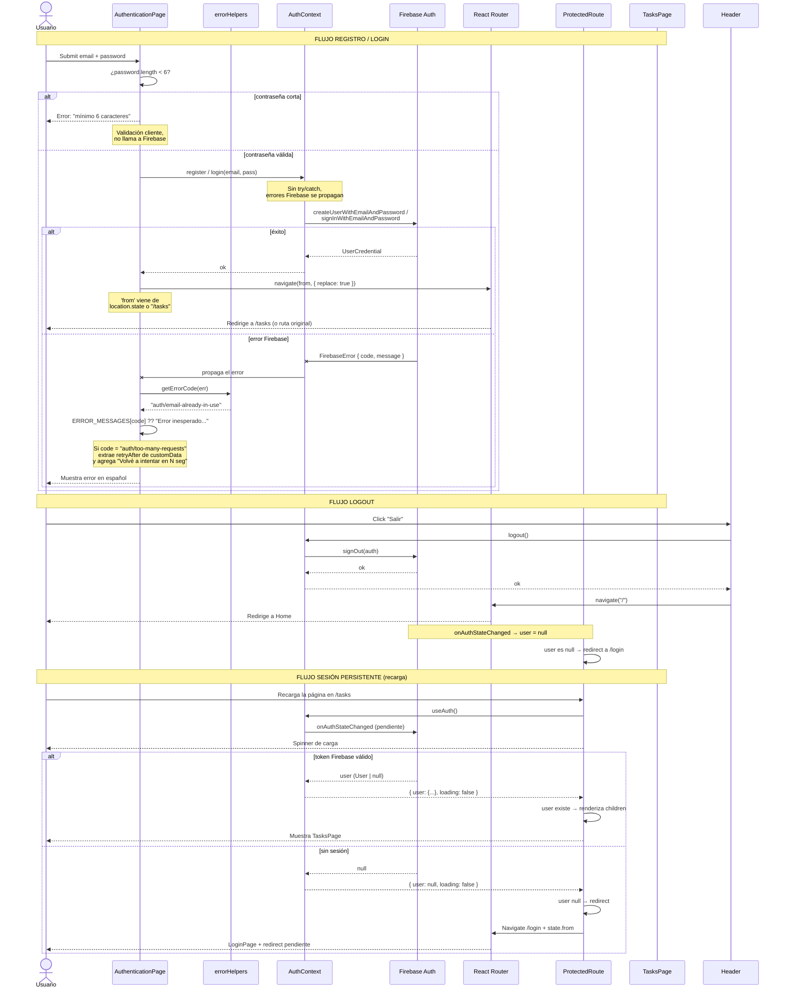
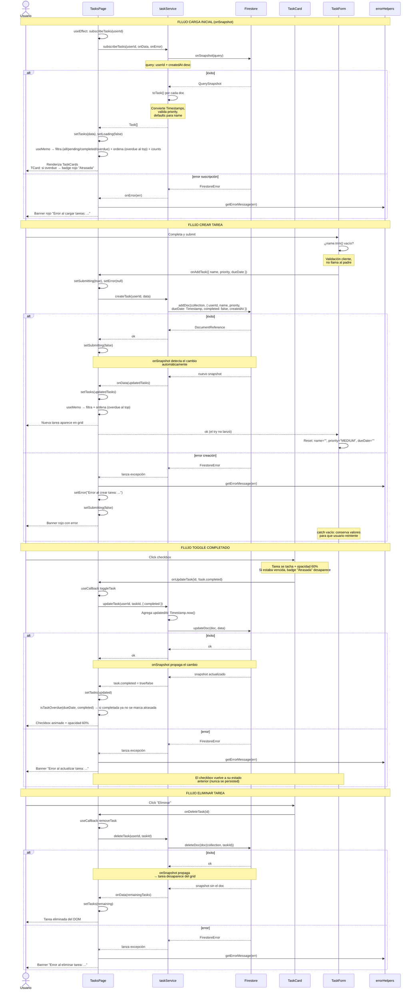
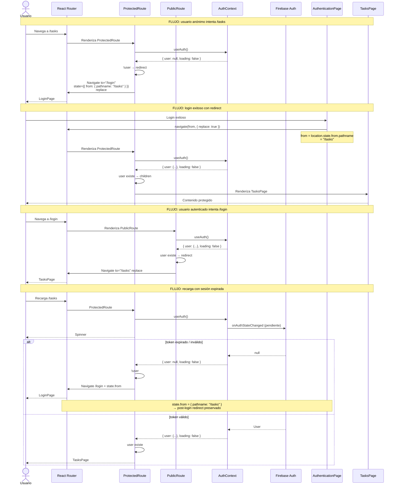
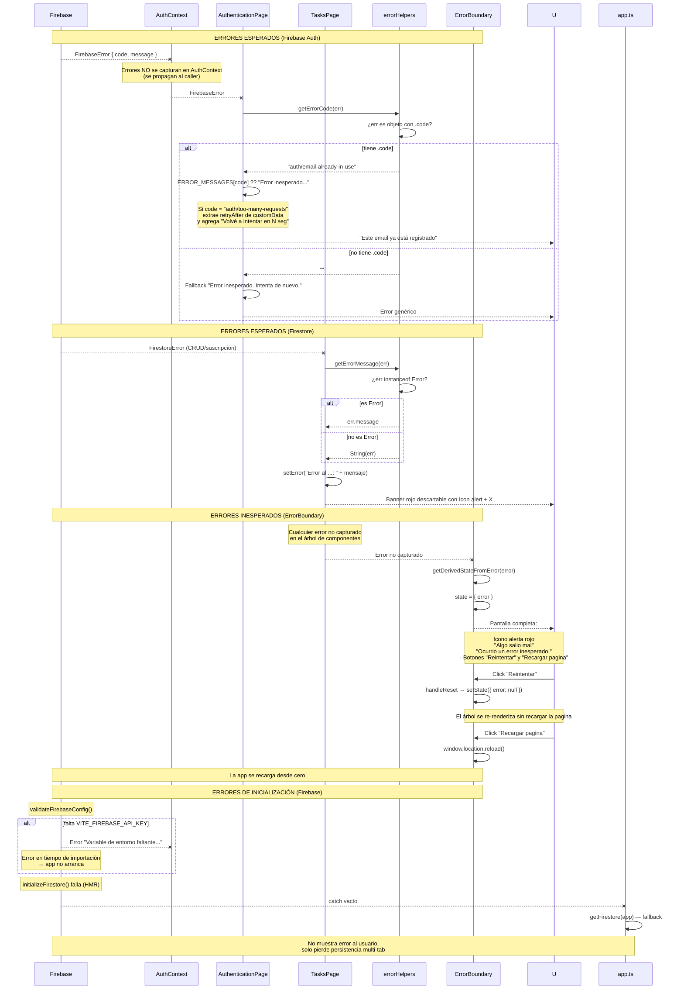

# Diagramas de secuencia — TaskMaster

## 1. Autenticación (registro, login, logout, sesión persistente)

---

## 2. Tareas en tiempo real (suscripción, CRUD, propagación)

---

## 3. Navegación con guards (protección de rutas, redirect, estado preservado)

---

## 4. Manejo de errores (cadena completa: Firebase → UI)

## Resumen de la estrategia de manejo de errores

| Capa                   | Técnica                                        | Respuesta                                                        |
| ---------------------- | ---------------------------------------------- | ---------------------------------------------------------------- |
| **AuthContext**        | Sin try/catch, propaga errores                 | El consumidor decide                                             |
| **AuthenticationPage** | `getErrorCode()` + `ERROR_MESSAGES` map        | Mensaje en español en la UI                                      |
| **TasksPage**          | `getErrorMessage()` + `setError()`             | Banner rojo descartable                                          |
| **TaskForm**           | `catch {}` vacío (consume errores)             | Conserva valores del formulario                                  |
| **ErrorBoundary**      | `getDerivedStateFromError()` + `handleReset()` | Pantalla completa con "Reintentar" (remount) y "Recargar página" |
| **Firebase init**      | `try {} catch {}` con fallback                 | Degradación silenciosa                                           |
| **Route guards**       | Spinner + `Navigate`                           | Redirección sin error visible                                    |
